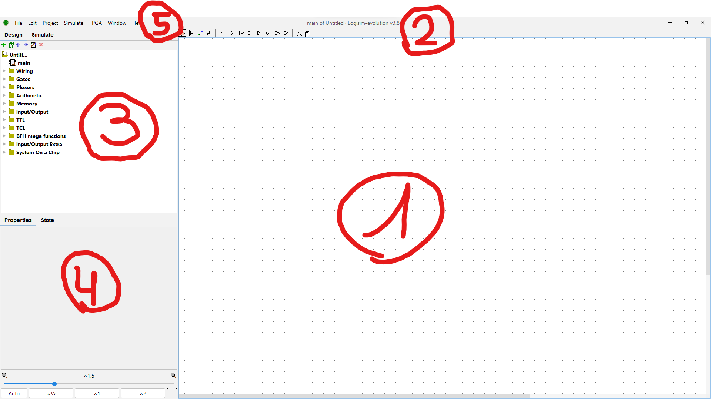
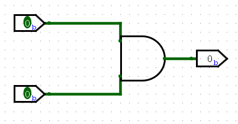
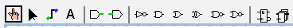
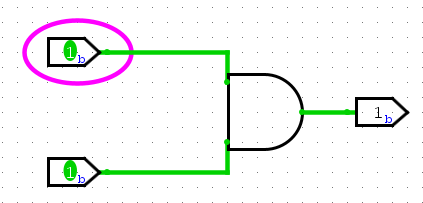
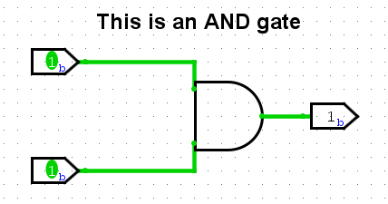
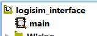
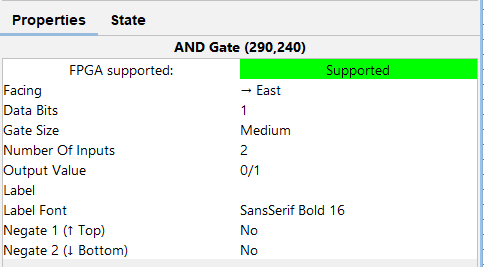

# Interface générale de Logisim

Maintenant que Logisim est installé, il va falloir apprendre à l'utiliser. La première étape est d'appréhender l'interface et de se familiariser avec celle-ci.

## Vue d'ensemble

L'interface de Logisim se décompose en **5 parties principales**

### 1. Le plan de travail

C'est dans ce grand espace (vide pour l'instant) que tu créeras tes meilleurs circuits avec tes portes préférées, et d'autres outils indispensables décris dans la suite de ce site.

Une fois le travail commencé, ce plan de travail ressemblera à quelque chose comme ça :

### 2. La barre d'outils

Sans doute la partie qu'il est le plus important de comprendre. Ce sont les outils que tu pourras utiliser pour modifier ton circuit, ainsi que les portes principales (NOT, AND, OR, XOR, ...).

De gauche à droite :

#### **La main**

La main est un outil qui te permet principalement de modifier la valeur des entrées de ton circuit. Pour reprendre l'exemple du circuit plus haut, on pourrait vouloir simuler le cas où les deux entrées sont à 1 au lieu de 0.

Pour ce faire, sélectionne l'outil **main**, puis clique sur le bit que tu désires modifier. Ici, on travaille avec des entrées à 1 seul bit chacune, mais on verra [plus tard](logisim-05.md) comment créer des entrées de plusieurs bits. Le processus sera le même, clique simplement sur le bit à changer, et sa valeur passera de 1 à 0 et inversément.

#### **Le pointeur**

L'outil qui ressemble à un curseur de souris tout simple te permettra de modifier ton circuit au sens large du terme. Il te permettra de sélectionner des éléments de ton circuit, de les déplacer, d'en ajouter, de les relier par des câbles, et ainsi de suite.

> Si tu ne parviens pas à modifier ton circuit ou à déplacer des éléments, tu as probablement sélectionné l'outil **main** plutôt que l'outil **pointeur**.

#### **Les câbles**

L'outil **pointeur** te permet d'ajouter des câbles en partant d'extrêmités d'éléments nécessitant des câbles (par exemple, en cliquant sur le fil sortant d'une entrée et en maintenant le clic pour créer un câble jusqu'à une autre entrée).

L'outil **câble**, quant à lui, te permet d'ajouter... Des câbles. Partout. Pas besoin de cliquer sur l'extrêmité d'un élément pour créer un câble, clique n'importe où avec cet outil pour en créer un et bouge la souris en laissant le clic appuyé afin de créer le fil jusqu'à l'endroit désiré.

#### **Le texte**

Si tu es un·e psychopathe comme moi, tu utiliseras peut-être cet outil pour commenter tes circuits. Il te permet d'ajouter du texte n'importe où dans tes circuits, ce qui peut être utile au même titre que les commentaires en programmation.

Cela dit, à part moi, j'ai rarement vu qui que ce soit utiliser ce genre de pratiques...

#### **Entrées et sorties**

Deux pour le prix d'un. Les deux outils suivants (avec les barres vertes qui sortent respectivement à droite et à gauche) sont des entrées et des sorties.

Le fil (vert) d'une entrée est dirigé vers la droite pour montrer que le courant "entre" dans le circuit, alors que le fil (toujours vert) d'une sortie est dirigé vers la gauche pour montrer que le courant lui vient du circuit.

Anyway, un bon exemple se trouve dans l'image utilisée ci-dessus. On a bien deux entrées et une sortie. Ces entrées et sortie ont été ajoutées grâce à ces outils-là. Pour en ajouter, sélectionne simplement l'outil que tu désires (entrée ou sortie) et promène ton curseur sur le plan de travail. Clique là où tu désires ajouter l'élément et il se placera là où ton curseur se trouve.

#### **NOT, AND, OR, XOR, NAND, NOR, D-FLIP-FLOP, REGISTER**

Les outils suivants sont des portes logiques que tu peux ajouter à ton circuit directement de la même manière qu'avec une entrée ou une sortie.

En cas de doute, survole l'une d'elles avec ton curseur, et le nom de la porte s'affichera.

Attention cela dit à respecter les critères du TP s'il y en a. Dans certaines parties, tu n'as le droit d'utiliser que certains composants et pas d'autres (uniquement faire avec des AND/NOT, etc...).

### 3. Les composants additionnels

Dans la barre d'outils se trouvent les composants principaux (portes souvent utilisées, D-Flip-Flop, etc...), mais il existe bien d'autres composants que tu peux utiliser dans tes circuits.

On aura l'occasion d'en reparler dans des [tutos qui suivent](logisim-06.md), pour l'instant remarque simplement l'arborescence de dossiers. C'est dans ces dossiers que se trouvent certains composants qui vont t'être utiles durant les prochains tutoriels et les prochains TPs.

**En plus de ces composants**, remarque la section tout en haut de cette arborescence, qui ressemble à :

`logisim_interface` est ici le titre du projet (donc le nom du fichier où mon projet est sauvegardé). `main` est le nom du circuit que je suis en train de modifier. Dans le [dernier tutoriel](logisim-08.md) de ce site, nous verrons comment créer plusieurs circuits dans un seul projet et en quoi cela est très utile.

### 4. Propriétés

Lorsque tu sélectionneras un élément de ton circuit avec l'outil **curseur**, ses propriétés s'afficheront dans cet onglet. Par exemple, si je sélectionne une porte AND toute simple:

Nous verrons ces propriétés plus en détails [plus loin dans les tutoriels](logisim-05.md).

### 5. Le menu

Comme de nombreuses applications, Logisim dispose d'un menu en haut à droite qui te permettra principalement de :

 - Sauvegarder ton projet/ouvrir un projet existant
 - Accéder aux paramètres (langue, ...)
 - Gérer la simulation de ton circuit ([clocks](logisim-07.md), ...)
 - Tester ton circuit sur les GECKOS (FPGA)
 - [Générer des circuits à partir de tables de vérités](logisim-04.md)

Les paramètres se trouvent dans `Fichier` > `Préférences`.

## Projet Logisim

Le projet Logisim utilisé pour les captures d'écran de ce tutoriel peut être téléchargé via <a href="/assets/logisim/projects/logisim_interface.circ" download="logisim_interface.circ">ce lien</a>