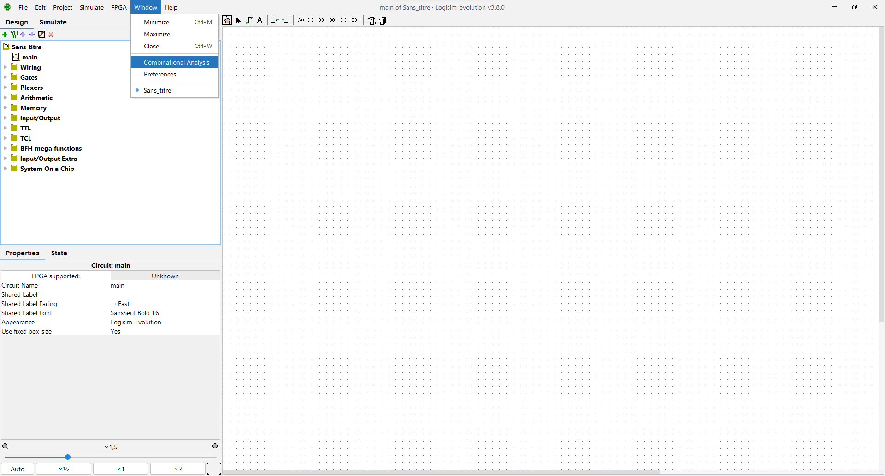
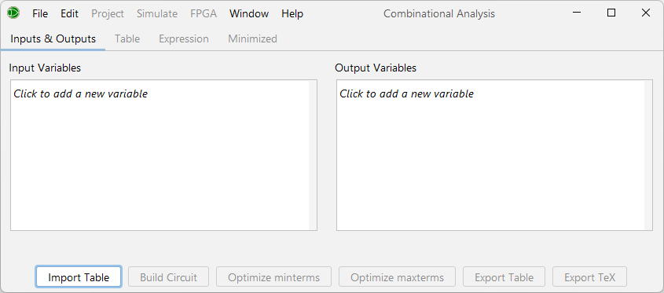
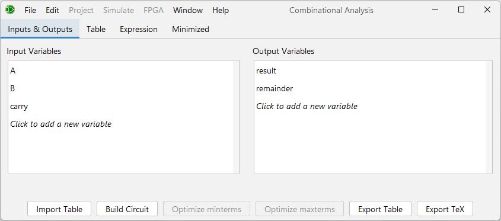
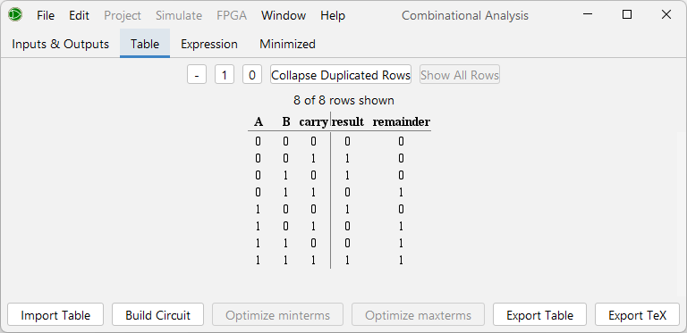
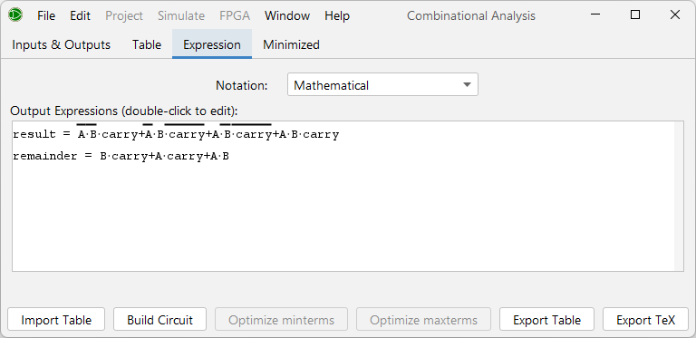
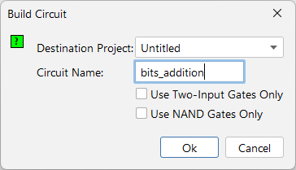
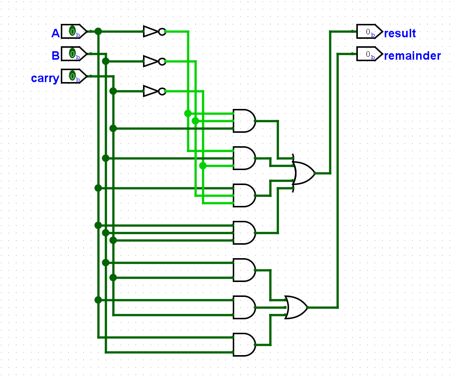

# Générer des circuits (Logisim)

Dans certains cas, les circuits à créer sont longs à créer à la main et plus simple à générer automatiquement.

Il est en effet possible de demander à Logisim de **générer automatiquement des circuits à partir de tables de vérité** (*truth table*).

## Exemple d'utilisation

Supposons pour cet exemple qu'on souhaite à nouveau créer un additionneur de bits. On a alors deux bits en entrée, `A` et `B`, ainsi qu'un `carry`. En sortie, on demande le résultat de l'addition ainsi qu'un éventuel `remainder`.

Sauf que cette fois-ci, on va générer le circuit automatiquement grâce à une table de vérité.

Pour cela, rends-toi dans le menu de Logisim en haut à gauche, sous `Fenêtre` > `Analyse combinatoire`.

Tu devrais alors voir une fenêtre comme la suivante apparaître.

### Lister les variables

Dans ce premier onglet `Entrées et sorties`, tu vas pouvoir lister tes variables... d'entrée et de sortie, comme les tables de vérité vues en cours.

Pour notre circuit d'exemple, on a `A`, `B`, `carry` en entrée et `result`, `remainder` en sortie, comme ceci :

### Compléter la table de vérité

Passons maintenant à l'onglet suivant, `Table`, et remplissons la table de vérité avec les résultats désirés.

Par exemple, si `A` et `B` sont tous deux 1, alors on aura un 0 en `result` et un 1 en `remainder`.

On remplit ainsi chaque ligne de la table. Note qu'il est possible de laisser un "-" dans le cas d'un *don't care*, si on s'en fiche de l'output dans ce cas-là. Cela rend le remplissage plus simple.

On obtient ainsi notre table :

### Expression et *Karnaugh diagram*

Une fois la table complétée, Logisim génère pour nous l'expression logique correspondant à la table de vérité qu'on lui a donnée dans l'onglet `Expression`.

Logisim génère également le *Karnaugh diagram* correspondant à l'expression et trouve une expression minimisée pour la décrire, dans l'onglet `Karnaugh`.

### Générer le circuit

Une fois toutes ces données obtenues, Logisim est capable de générer le circuit. Pour ceci, appuie sur le bouton `Construire le circuit` en bas à gauche de la fenêtre d'analyse combinatoire.

Tu pourras alors définir différents paramètres comme le projet de destination, le nom du circuit ou encore certaines contraintes sur le circuit à générer. Tu peux tester toutes ces possibilités par toi-même en téléchargeant le projet et la table de vérité utilisés dans cet exemple, les liens sont plus bas.

Le circuit sera alors généré selon les contraintes données. Sans donner de contrainte particulière, voilà le circuit généré :

## Autres possibilités - importer et exporter les tables de vérité

Comme tu l'as probablement remarqué, à côté du bouton `Construire le circuit` se trouvent des boutons d'importation et d'exportation de la table de vérité. Cela te permet de remplir la table plus simplement si tu as déjà un fichier texte contenant la table sous la main.

Par exemple, tu peux utiliser cette fonctionnalité pour importer la table de vérité utilisée dans cet exemple sans avoir à la recopier (même si c'est pas très compliqué, ça c'est sûr).

## Projet Logisim et table de vérité

Le projet Logisim utilisé dans l'exemple ci-dessus est téléchargeable via <a href="/assets/logisim/projects/logisim_truth_tables_generate_circuits_with_truth_tables.circ" download="logisim_truth_tables_generate_circuits_with_truth_tables.circ">ce lien</a>.

La table de vérité utilisée peut quant à elle être téléchargée via <a href="/assets/logisim/truth-tables/logisim-truth-tables-generate-circuits-with-truth-tables.txt" download="logisim-truth-tables-generate-circuits-with-truth-tables.txt">ce lien</a>.