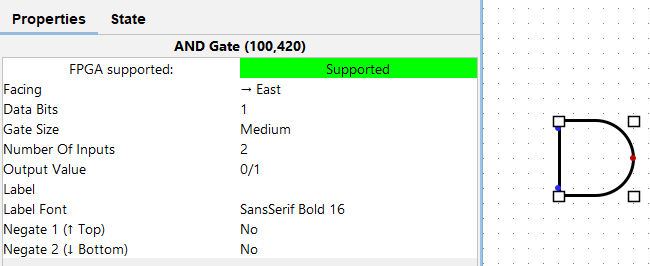
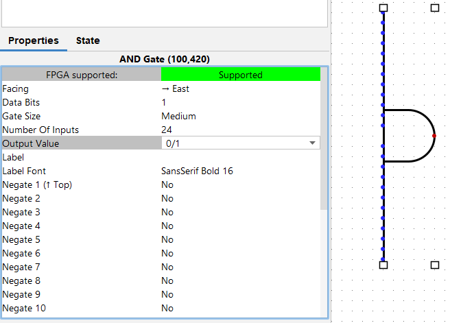
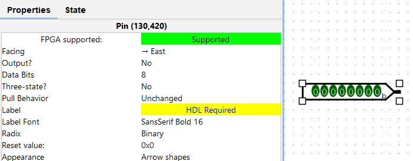
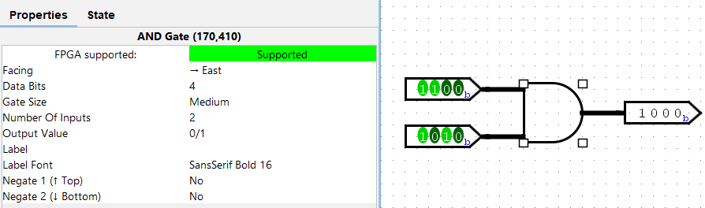

# Propriétés des blocs Logisim

Dans Logisim, on travaille avec des objets. Par exemple, une porte AND et un objet. Un input en est un autre.

**Ces objets ont des propriétés** qui te permettent de mieux expliquer à Logisim ce que tu attends et de te simplifier la vie pour des opérations plus complexes.

## Exemple 1 : la porte AND à 24 entrées

Tu as 24 valeurs en entrée et tu aimerais vérifier qu'elles soient toutes à 1? Qu'à cela ne tienne, grâce aux propriétés de la porte AND, tu peux réaliser cela sans problème !

> On s'accordera cependant sur le fait que ça risque peu de t'arriver durant le cours lul

Crée une porte AND dans ton projet de manière normale, puis sélectionne-la avec l'outil curseur. Tu peux à présent accéder aux propriétés de l'objet en bas à gauche :

Si tu passes `Nombre d'entrées` à 24, la porte AND s'adaptera automatiquement pour accueillir 24 variables d'entrée et vérifier qu'elles soient toutes à 1.

Remarque que pour chaque entrée, tu peux définir si tu désires inverser la valeur de l'entrée ou non, grâce à `Inverseur i` avec `i` le numéro de l'entrée. Cela peut t'éviter d'utiliser de nombreuses portes NOT par exemple.

## Exemple 2 : Créer des vecteurs de bits

Après quelques semaines de cours, tu utiliseras des vecteurs de bits, c'est-à-dire des valeurs qui font plus d'un bit. Par exemple `01101011`. Tu peux créer de tels entrées de la manière suivante.

1) Crée une entrée (*input*) normalement

2) Dans les propriétés de ton input, modifie l'attribut `Largeur données`. Si par exemple tu mets cette valeur à `8`, ton entrée comptera 8 bits au lieu de 1. Elle s'affichera aussi différemment : 

Tu peux toujous modifier la valeur de cette entrée de la même manière qu'une entrée normale, avec l'outil représentant une main, et en cliquant sur le bit que tu désires changer.

> Le processus est strictement le même si tu as besoin d'une sortie (*output*) de plusieurs bits au lieu d'un seul

Les vecteurs de bits seront abordés plus en détails dans les [astuces sur les *Splitters*](logisim-06).

## Exemple 3 : Utiliser une porte AND sur des vecteurs de bits

Mettons que tu as **deux vecteurs de bits, et que tu aimerais effectuer une opération bit à bit** (on prend les deux premiers bits des deux vecteurs, et on effectue l'opération avec eux, puis les deux deuxièmes bits, etc...).

Par exemple réalisons une opération AND bit à bit. Pour cela, crée deux entrées de 4 bits chacune, et une sortie de 4 bits également.

Le bit 0 de la sortie représentera le résultat de la porte AND sur les deux bits 0 des deux vecteurs d'entrée, etc...

Crée ensuite une porte AND (une seule). Sélectionne-la, et dans ses propriétés, modifie `Largeur données` à 4. Cela signifie que **la porte AND prendra des vecteurs de 4 bits en entrée et effectuera une opération bit à bit**, avant de donner en sortie un vecteur de 4 bits contenant chacun des résultats, comme dans cet exemple :

Tu peux également combiner les exemples 1 et 3 pour créer une porte AND avec 5 inputs de 8 bits chacun, par exemple.

## Projet Logisim

Le projet utilisé pour imager ce tutoriel peut être téléchargé via <a href="/assets/logisim/projects/logisim_blocks_use_object_properties.circ" download="logisim_blocks_use_object_properties.circ">ce lien</a>