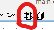
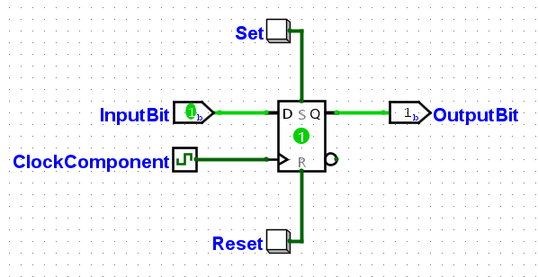

# D-Flip-Flop

Le composant D-Flip-Flop est très utile dans tous les circuits qu'on crée en DSD (ou presque). C'est un composant essentiel car il permet la mémorisation.

Le but de ce tuto n'est pas de refaire le cours concernant le D-Flip-Flop, mais de te permettre de mettre en pratique ce que tu as appris en cours dans Logisim directement.

## Ajouter un D-Flip-Flop à ton circuit

Pour ajouter un D-Flip-Flop à un circuit, rien de plus simple. Utilise l'élément dédié dans la barre d'outils rapide:

## Que brancher à un DFF et comment?

Un D-Flip-Flop peut être utilisé de bien des manières:

### InputBit

L'entrée du DFF. C'est (un peu) nécessaire à son fonctionnement. Note que tu peux modifier les propriétés d'un DFF pour qu'il prenne en entrée plus de 1 bit. Il donnera le même nombre de bits en sortie.

### OutputBit

La sortie du DFF, qui ne change que lors d'un *rising edge* de la clock.

### ClockComponent

La clock, justement. Ce composant est un signal qui change de manière régulière, généralement utilisé pour que le système change d'état à chaque tick.

Les clocks sont abordés avec un peu plus de détails dans le [tutoriel suivant](logisim-08.md).

Ce composant est également nécessaire au fonctionnement du DFF.

### Set&Reset

On n'a pas vu cette forme d'entrée dans les tutoriels, il s'agit tout simplement de bouton (=1 quand tu appuies dessus, =0 le reste du temps).

Ces sets&reset sont très utiles et tu devras les utiliser durant les TPs. Pas besoin de les branches les deux, généralement tu n'en brancheras qu'un, soit le set, soit le reset.

C'est ces entrées du DFF qui te permettent de définir la valeur de sortie de ce DFF, quelles que soient la valeur de la clock ou la valeur de l'entrée InputBit.

C'est ce que tu utiliseras lorsque tu devras créer un bouton Reset pour remettre ton système à zéro, par exemple dans le TP3/4. Souviens-toi bien de cette fonctionnalité, sans quoi tu pourrais perdre du temps à essayer de l'implémenter toi-même d'une manière relativement peu efficace, moche et illisible (non je parle pas d'expérience je vois pas de quoi tu parles).

## Projet Logisim

Le projet Logisim utilisé dans ce tutoriel peut être téléchargé via <a href="/assets/logisim/projects/logisim_dff.circ" download="logisim_dff.circ">ce lien</a>. Tu peux t'amuser un peu avec le DFF pour voir comment il fonctionne, avec les boutons Set et Reset, etc...