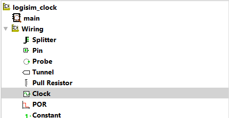
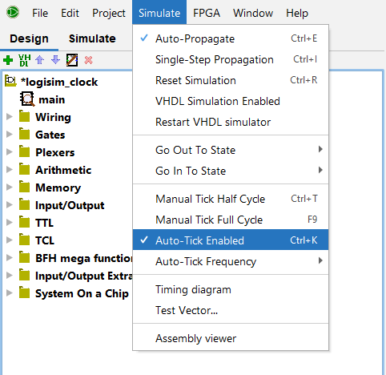

# Activer/Désactiver les clocks (Logisim)

Il peut être très agaçant de travailler avec une clock qui est simulée en permanence. On cherche à modifier le circuit, mais la clock continue de fonctionner, ce qui cause des erreurs, un peu comme IntelliJ qui souligne une ligne en rouge alors qu'on n'a pas fini de l'écrire (oui je sais j'ai des problèmes de riche).

Il est cependant possible de désactiver la simulation de la clock pendant qu'on travaille sur le circuit. Cela permet aussi d'éviter d'être distrait·e. 

## Déjà, où qu'on trouve une clock?

Les clocks peuvent être ajoutées à ton circuit via la liste de composants moins importants (les dossiers sur le côté gauche de l'interface).

Elle se trouve dans le dossier *Câblage* > *Horloge*.

## Comment qu'on l'active/désactive?

Pour gérer l'activation de la simulation de ta clock, rends-toi dans le menu en haut à gauche de la fenêtre Logisim, `Simulation` > `Tics activés`. En cliquant sur cet élément, tu inverseras l'état d'activation de ta clock.

C'est-à-dire que si ta clock était activée, elle sera désactivée, et si elle était désactivée, elle fonctionnera à nouveau.

## Projet Logisim

Le projet Logisim utilisé dans ce tutoriel (plutôt inutile faut le dire) peut être téléchargé via <a href="/assets/logisim/projects/logisim_clock.circ" download="logisim_clock.circ">ce lien</a>.