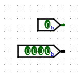
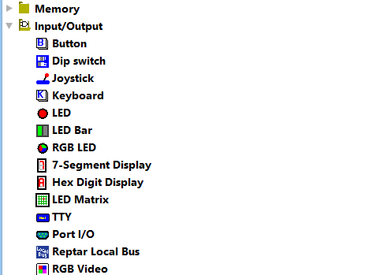
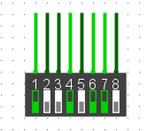

# Le DIP-switch

On a vu les inputs tout simples, à 1 ou plusieurs bits.

Il existe cependant d'autres formes d'inputs utilisables dans Logisim, qu'on peut notamment trouver dans la catégorie `Entrée/Sortie` des différents composants disponibles à gauche de l'interface de Logisim.

On va s'intéresser ici tout particulièrement au `DIP-switch`, qui est un type d'**entrée**. On s'attardera dans le tutoriel suivant sur un type de **sortie** spécial : l'[`Afficheur 7 segments` (*Seven segments display* en anglais)](logisim-10.md).

## Quel intérêt a le DIP-switch?

En réalité, le DIP-switch est assez simple à comprendre. Il s'agit d'un type d'entrée qui est équivalent à plusieurs inputs simples de 1 bit.

Voici à quoi un DIP-switch ressemble :

Il s'agit donc d'un système équivalent à 8 inputs de 1 bit chacun (il est possible, bien entendu, de modifier le nombre d'interrupteurs dans les propriétés du DIP-switch).

## Travailler avec un DIP-switch

Pour modifier la valeur des entrées, il suffit de se servir du curseur en forme de main pour cliquer sur l'interrupteur qui nous intéresse. La valeur de celui-ci sera modifiée.

## Pourquoi en parler ici?

Le DIP-switch n'est pas très intéressant en lui-même, mais il est utilisé par le professeur dans différents modèles qu'on utilise pour commencer un TP.

Je me suis donc dit que c'était worth it de rajouter une mention d'un DIP-switch, ainsi tu sais à quoi tu à affaire.

## Projet Logisim

Le projet (inutile) Logisim utilisé dans ce tutoriel peut être téléchargé via <a href="/assets/logisim/projects/logisim_dip_switch.circ" download="logisim_dip_switch.circ">ce lien</a>.