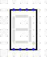
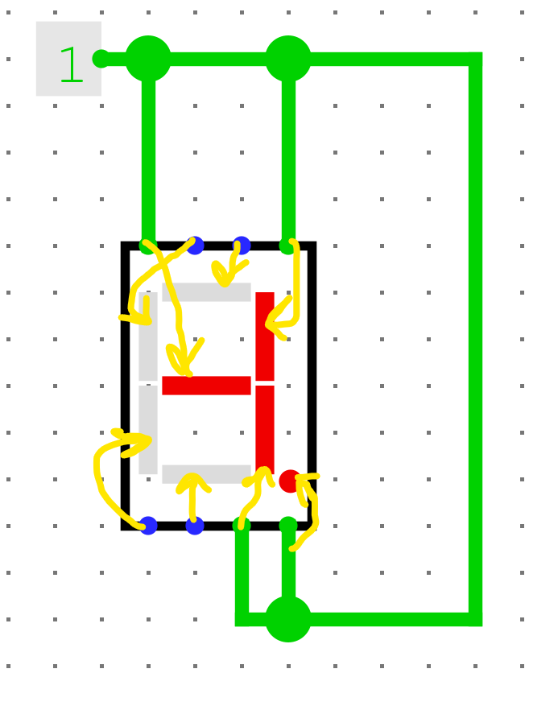
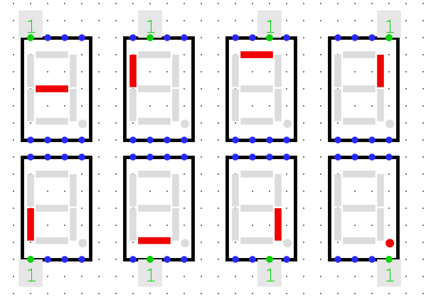

# L'afficheur 7 segments

L'afficheur 7 segments (*7 segments display* en anglais) est un type de sortie bien particulier qui est utilisé dans certains TPs, voilà pourquoi il est présenté ici en vitesse.

## Trouver l'afficheur 7 segments

L'afficheur 7 segments se trouve dans le dossier des entrées/sorties, tout comme le DIP-switch qu'on a vu dans le [tutoriel précédent](logisim-09.md).

## Utiliser l'afficheur 7 segments

Un afficheur 7 segments se présente de la manière suivante dans un circuit:

Chaque point bleu représente une entrée pour donner du courant à cet afficheur 7 segments. Note que cela s'appelle un afficheur **7** segments, mais qu'il y a **8** bits d'entrée. Cela s'explique par la présence du point en bas à droite de l'afficheur, qui a son propre bit d'entrée.

Voici une map de la correspondance entre les bits et les segments:

Comme tu peux le voir, les segments s'allument lorsque l'entrée correspondante est à 1. Si elle est à 0, ils restent éteints.

De nombreuses options sont disponibles dans les propriétés de l'afficheur 7 segments, comme changer la couleur d'allumage des segments, ...

Cependant il est déconseillé de jouer avec ces propriétés, **particulièrement dans les TPS notés**, puisqu'il s'agit généralement d'éléments qui font partie du modèle de départ du TP et que le professeur a déjà correctement configuré.

> Note : le 1 encadré que tu peux voir sur l'image ci-dessus est un composant appelé une constante. C'est simplement une valeur constante que tu peux fixer à 1 ou 0, c'est plus pratique que de créer une entrée à part entière. Tu peux trouver ce composant de constante dans le dossier câblage.

## Aide-mémoire

Il est parfois difficile de se souvenir de quel bit allume quel segment, voici un petit aide-mémoire sous forme d'event:

## Documents (in)utiles

Le projet Logisim utilisé dans ce projet peut être téléchargé via <a href="/assets/logisim/projects/logisim_7_segments_display.circ" download="logisim_7_segments_display.circ">ce lien</a>.

L'image d'aide-mémoire peut être téléchargée au format PNG via <a href="./assets/images/logisim-7-segments-display-cheatsheet.png" download="logisim-7-segments-display-cheatsheet.png">ce lien</a> ou <a href="/assets/docs/pdfs/logisim-7-segments-display-cheatsheet.pdf">celui-ci en PDF</a>.