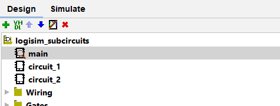
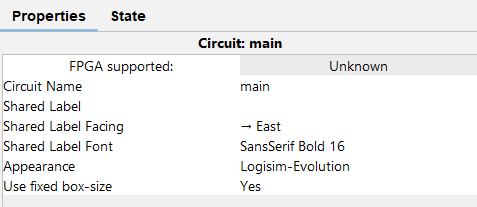
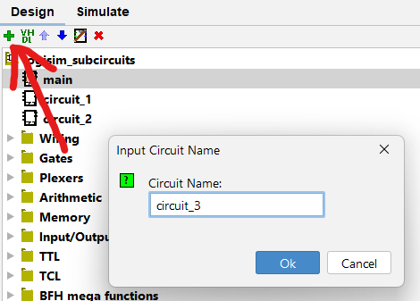
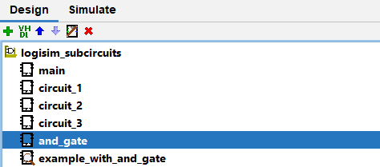
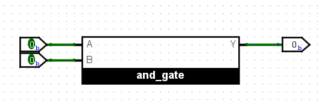
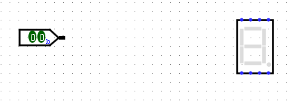
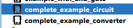
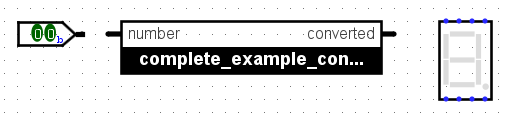
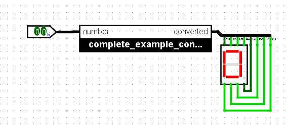

# Maîtriser les sous-circuits (Logisim)

Les circuits devenant de plus en plus complexes, il faut trouver des manières de les garder lisibles et modulaires, en évitant au maximum le copié collé.

Pour cela, en programmation, on a les fonctions. En DSD, on a les **sous-circuits**.

## Qu'est-ce qu'un sous-circuit

Un sous-circuit est un circuit normal, comme tu en as déjà peut-être créé quelques-uns sur Logisim. Il est composé d'inputs et d'outputs, avec une logique entre deux composée de portes logiques, de DFF (= *D-Flip-Flop*), etc...

Mais on va prendre cette notion de circuit au niveau supérieur. Par exemple, un DFF n'est qu'un circuit composé de plus petites portes. Mais on ne le recrée pas à chaque fois, on utilise le composant D-Flip-Flop plutôt que de copier-coller un circuit existant.

De même qu'on va utiliser un circuit DFF déjà fait, on peut utiliser nos propres circuits... Dans nos propres circuits. En effet, les circuits qu'on crée ne sont pas si différents d'un DFF. Ils sont composés d'entrées, de sorties et de logique entre les deux.

## Liste des circuits existants

On introduit à présent la possibilité d'avoir plusieurs circuits dans un même projet, si tu ne la connaissais pas déjà.

Tes circuits sont listés dans la liste des composants secondaires au milieu à gauche de l'interface Logisim comme ci-dessous:

Par défaut, le nom du circuit principal de ton projet est `main` lorsque tu crées un projet, mais tu peux changer ce nom en sélectionnant ton circuit et en allant dans ses propriétés (de la même manière qu'un composant d'un circuit).

> Remarque que le circuit `main` a ici l'icône d'une loupe à côté de son nom, contrairement aux autres. Cette loupe indique quel circuit est actuellement affiché dans l'espace de travail (où tu peux modifier ton circuit, ...). **Pour afficher un autre circuit et le modifier, double-clique sur le nom du circuit que tu veux ouvrir.**

## Créer un nouveau circuit

Pour créer un circuit supplémentaire et l'ajouter à ton projet, clique sur le bouton de "+" vert en haut à droite, et donne un nom à ton circuit. Ce nom ne peut contenir que des lettres, des chiffres et des caractères "_".

## Utiliser un circuit dans un autre

Maintenant qu'on sait comment créer plusieurs circuits, on aimerait faire usage de cette connaissance.

**Imaginons que j'aie un circuit `and_gate` dont la seule fonction est d'appliquer une porte AND** à ses inputs. C'est donc un circuit très peu utile, mais c'est pour que l'exemple reste simple. Un exemple plus complexe peut être trouvé ci-dessous.

Je désire utiliser mon circuit `and_gate` à la place d'une porte AND normale dans un autre circuit. Comme faire?

Dans l'onglet *Conception*, là où sont listés tes circuits, assure-toi que le circuit où tu désires ajouter ton sous-circuit est bien celui qui est affiché, sinon affiche-le.

Ensuite, sélectionne (par un simple clic, pas double) le sous-circuit que tu désires ajouter (ici, `and_gate`).

Enfin, ajoute-le comme un composant normal. Tu remarqueras que par défaut le sous-circuit s'affiche comme un rectangle avec la liste des entrées d'un côté et la liste des sorties de l'autres, pouvant bien entendu être utilisées dans le circuit parent.

On a donc ici une porte AND fonctionnelle. C'est ainsi qu'on utilise un sous-circuit. Bien sûr, c'est plus utile avec un circuit plus complexe, comme on aura l'occasion de le voir dans l'exemple qui va suivre.

> Il est possible de modifier l'affichage et l'apparence de ton sous-circuit dans Logisim, mais cela est purement esthétique, et je ne compte pas faire de tutoriel dessus. Sache simplement qu'en modifiant la propriété `Apparence` du circuit et en cliquant droit dessus, tu peux trouver `Modifier l'apparence` qui t'emmènera vers un éditeur d'apparance de circuit. Honnêtement, finis ton projet d'abord, ça sert strictement à rien pour l'évaluation.

## Exemple plus complet

Mettons que j'ai un input de 2 bits. Je désire afficher la valeur qu'il représente en binaire sur un [afficheur 7 segments](logisim-10.md).

Je pourrai convertir directement dans ce circuit, mais sachant que je devrai ajouter des choses par la suite, le problème serait que je perdrait en lisibilité. Si en plus je dois réaliser cette conversion ailleurs, je devrais la copier-coller.

On va donc plutôt utiliser un sous-circuit qui s'occupe de la conversion de la manière la plus transparente possible.

Notre sous-circuit prendra en entrée un vecteur de 2 bits et donnera en sortie un vecteur de 8 bits représentant les 8 bits à donner en entrée à l'afficheur 7 segments.

Je me contente de [générer toutes les possibilités grâce à une table de vérité, et Logisim générera le convertisseur pour moi](logisim-04.md).

J'appelle le circuit principal `complete_example_circuit` et le convertisseur `complete_example_converter`.

Je me trouve donc avec ces deux circuits:

Je dois utiliser le deuxième dans le premier. Pour cela je sélectionne le deuxième et le place dans mon circuit principal:

Je n'ai qu'à brancher l'entrée de mon circuit principal à celle de mon sous-circuit.

En revanche, pour la sortie, il faut un peu plus réfléchir. En effet, mon sous-circuit sort un vecteur de 8 bits, et je dois séparer ces bits et les brancher au bon endroit. On fait cela au moyen d'un [splitter](logisim-06.md), puis on connecte correctement les bits individuellement. Heureusement, le circuit est suffisamment bien pensé pour que le résultat soit joli:

À présent, je peux changer l'input de mon circuit autant que je le désire, et l'afficheur 7 segments suivra.

## Projet Logisim

Le projet Logisim utilisé dans ce tutoriel peut être téléchargé via <a href="/assets/logisim/projects/logisim_subcircuits.circ" download="logisim_subcircuits.circ">ce lien</a>.