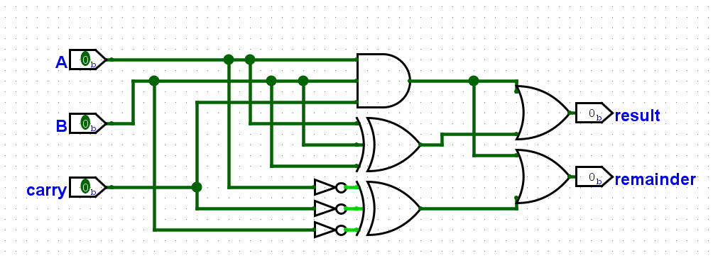
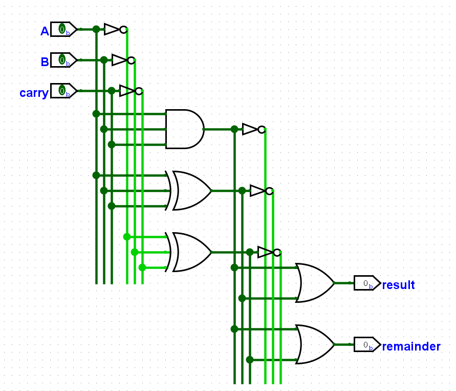
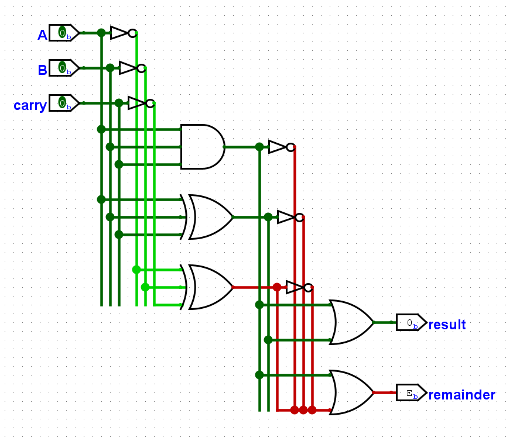

# Organiser ses câbles (Logisim)

Durant les TPs de DSD, du moins la première partie du semestre, tu utiliseras Logisim afin de créer et simuler des circuits.

Ces **circuits deviendront progressivement plus complexes**, et il y a quelques petites astuces pour garder des circuits lisibles et compréhensibles d'un coup d'oeil. L'une d'entre elles t'es présentée ici, l'autre, un peu plus avancée, se trouve [plus loin dans les astuces (sous-circuit et modularité)](logisim-07.md).

Pour commencer, cela dit, organiser tes câbles correctement devrait suffire.

## Mise en situation

**Supposons qu'on désire créer un additionneur de bits** tout simple. On a deux bits en entrée, A et B, qui sont 1 ou 0, et un `carry` qui pourrait provenir d'une addition précédente en cas d'addition bit par bit. Le circuit donne en sortie le résultat de l'addition ainsi que le remainder de l'addition qui a été effectuée.

Voici une implémentation possible :

> Remarque que des portes AND et XOR à **trois entrées** sont utilisées. Pas de panique, cette possibilité et d'autres encore sont explorées [plus loin sur ce site](logisim-04.md). Pour l'instant, concentrons-nous sur la lisibilité du circuit.

Le circuit est encore relativement simple, il est donc possible de comprendre ce qu'il fait avec de la patience et de la concentration... Mais on aimerait que ce soit encore plus **simple de comprendre ce que le circuit fait d'un coup d'oeil**.

## Introducing organisation des câbles

Une manière de rendre le circuit

 - Plus lisible
 - Plus joli et aéré (oui c'est important, le style avant tout)
 - Plus facilement extensible et/ou modifiable

est simplement de réarranger les câbles (ou de les arranger dès la création du projet) d'une manière intelligente et logique. Les circuits exemples du professeur ou d'autres circuits qu'on peut trouver sur le net utilisent la méthode suivante :

En arrangeant les inputs sur ces lignes de câbles, on voit facilement d'un coup d'oeil quel input est utilisé (puisqu'ils sont dans un ordre établi) et s'il s'agit de l'input ou de sa négation.

Il est donc recommandé d'utiliser cette méthode pour organiser son projet. Ça peut paraître inutile sur un petit circuit comme celui-ci, mais n'oublie pas que **les projets vont devenir plus complexes**, et c'est plus sympa si tu peux les relire facilement.

Même pour des projets simples, c'est toujours agréable de les organiser comme ceci. De plus, il faut prendre les bonnes habitudes dès le départ ;)

## Erreur de câblage

Une erreur très spécifique peut être rencontrée si on ne fait pas attention, comme ci-dessous :

L'erreur ici est due au fait que le câble qui relie la deuxième porte XOR à la deuxième porte OR **passe par les bouts des trois câbles des négations des inputs**. Lorsqu'un câble passe par le bout d'un autre câble, les deux se lient automatiquement.

La solution à ceci est simple : prolonge tes câbles vers le bas de quelques points de plus, afin de déplacer le bout plus bas et de pouvoir passer tes câbles sans problème.

## Projet Logisim

Si tu désires consulter le projet Logisim duquel proviennent les captures d'écrans de circuits utilisées sur cette page, tu peux <a type="button" href="/assets/logisim/projects/logisim_02_chaotic_addition_circuit.circ" download="logisim_02_chaotic_addition_circuit.circ">télécharger le fichier .circ ici</a>