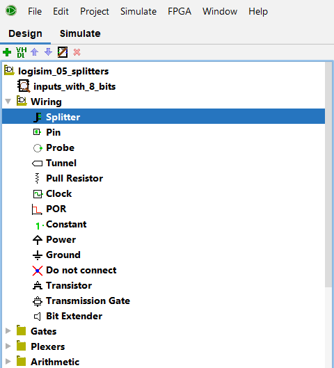
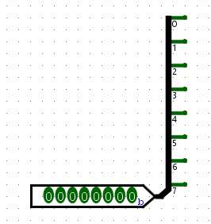
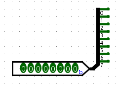
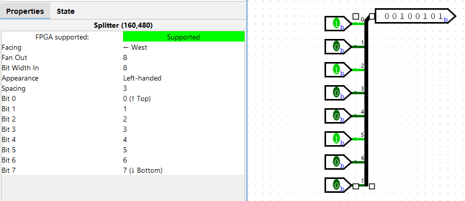

# Splitter (Logisim)

Comme déjà abordé dans le [tutoriel précédent](logisim-04), tu auras rapidement besoin de travailler avec des vecteurs de bits plutôt que des bits individuels.

Tu auras donc des entrées qui ressembleront plutôt à ceci :

Mais il arrivera que tu aies besoin d'effectuer une opération sur un bit bien précis de ce vecteur, ou deux bits précis, bref, que tu désires isoler certains bits.

**Isoler certains bits se fait grâce au Splitter**, que nous allons appréhender plus en détails dans ce tutoriel.

## Ajouter un Splitter à ton circuit

Pour ajouter un Splitter, rends-toi dans l'onglet `Conception` de Logisim en haut à droite, puis dans le dossier intitulé `Câblage`, tu trouveras un élément appelé `Répartiteur (Splitter)`. En le sélectionnant, comme ci-dessous, tu pourras l'ajouter à ton circuit de la même manière qu'une porte AND.

> Note : dans la suite de ce tutoriel, nous nous référerons à cet outil comme un Splitter et non pas un Répartiteur

## Modifier et utiliser le Splitter

Par défaut, le Splitter ajouté ressemblera probablement à quelque chose comme ça :

Comme tu peux aisément le constater, on a une entrée de 8 bits qui est donnée à un splitter qui supporte 2 bits.

Pour résoudre ce problème, on va sélectionner le Splitter et aller dans ses propriétés.

Un Splitter possède plusieurs propriétés spécifiques qui vont nous intéresser :

 - **`Nbr Terminaisons`** (En anglais `Fan Out`) : indique le nombre de fils sortant du Splitter. Par exemple, si on entre 8 comme valeur : 
 - **`Largeur faisceau`** (En anglais `Bit Width In`) : indique le nombre de bits pris en entrée par le Splitter. Par exemple, si je définis cette valeur à 4 : 
 - **`Bit i`** : Pour le ième bit d'entrée, indique dans quel bit de sortie la valeur doit aller. Cette propriété est expliquée ci-dessous à coups d'exemples
 - **`Espacement`** (`Spacing` en anglais) : indique combien de points séparent chaque fil de sortie du suivant. Par défaut, la valeur est de 1, et si on la modifie les fils de sortie s'espacent plus. Par exemple, avec une valeur de 2 : 

Tu l'auras compris, pour résoudre notre problème, on modifie la valeur de `Largeur Faisceau` (*`Bit Width In`*) à 8 pour faire correspondre l'entrée à la valeur donnée, ainsi l'erreur disparaît.

## Séparer les bits comme un·e pro

### Exemple 1 : séparer chaque bit

Si tu désire travailler avec chaque bit du vecteur séparemment, fais correspondre le nombre de bits en entrée avec le nombre de bits de sortie, et le Splitter donnera automatiquement un bit du vecteur pour chaque bit de sortie, comme ceci :

Grâce à la propriété `Bit i`, on peut modifier quel bit est exporté dans quelle sortie. Par exemple, si je désire garder le dernière sortie vide et avoir les bits d'entrée 6 et 7 dans l'avant-dernière sortie, je peux modifier la propriété `Bit 7` et lui dire de s'exporter dans la sortie 7 :

> Remarque que sous chaque bit de sortie sont écrit les bits qui sont exportés dans cette sortie. Par exemple, la première sortie donne la valeur du bit 0, ou l'avant dernière donne les valeurs des bits 7 à 6

### Exemple 2 : Obtenir un bit bien précis

Supposons qu'on désire uniquement connaître la valeur d'un des bits d'entrée. Rien de plus simple. Voici une configuration qui ne donne en sortie que le bit 0 du vecteur d'entrée :

### Et plus encore

N'hésite pas à jouer toi-même avec les propriétés du Splitter pour voir de quoi il est capable.

## Prendre plusieurs bits pour les unifier en un vecteur

On a appris à séparer des vecteurs en plusieurs bits, mais on peut aussi faire le processus inverse et réunir des bits dans un unique vecteur.

Pour cela, on change simplement l'orientation du Splitter (pour des raisons pratiques) et on branche les bits et vecteurs de bits aux "sorties" du Splitter, qui donnera en "entrée" un unique vecteur correspondant à la configuration donnée.

C'est vraiment la même chose que ce qu'on a fait jusqu'à présent, simplement dans l'autre sens.

### Exemple

Ici par exemple, on rassemble 8 bits individuels qu'on reçoit en entrée dans un seul vecteur de bits qu'on donne en sortie :

## Projets Logisim

Le projet Logisim utilisé dans ce tutoriel est téléchargeable via <a href="/assets/logisim/projects/logisim_05_splitters.circ" download="logisim_05_splitters.circ">ce lien</a>.